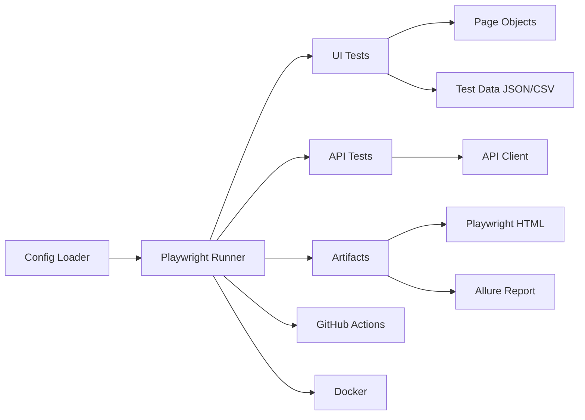

# Framework Architecture

## High-Level Flow

## Design Decisions

- POM keeps selectors and user actions reusable
- Config is centralized for environment switching
- Data-driven tests decouple test logic from input data
- Reporter setup stores both human-readable and CI-friendly results
- Retries + traces/videos improve flaky test diagnosis
